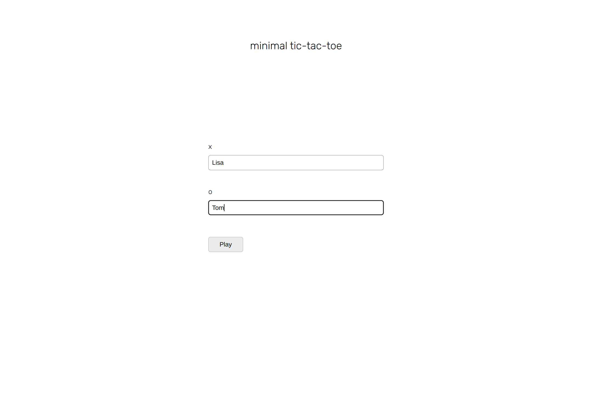
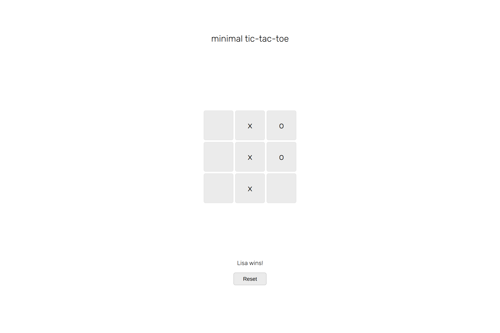

# Minimal Tic Tac Toe 🎲

  

  

<h2 align="center">
  <a href="https://nightrunner4.github.io/minimal-tic-tac-toe">👉 Demo</a>
</h2>

### About 📖

Second project of the JavaScript chapter in [The Odin Project](https://www.theodinproject.com). A good practice of objects, functions and the module pattern.

### Resources Used 📚

- [Google Fonts](https://fonts.google.com) (Font)

### Built With 🛠️

- HTML
- CSS
- JavaScript
